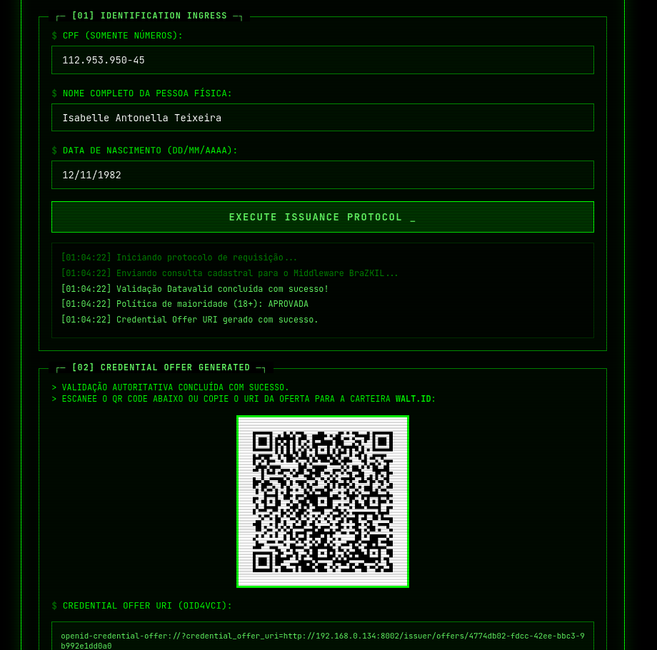
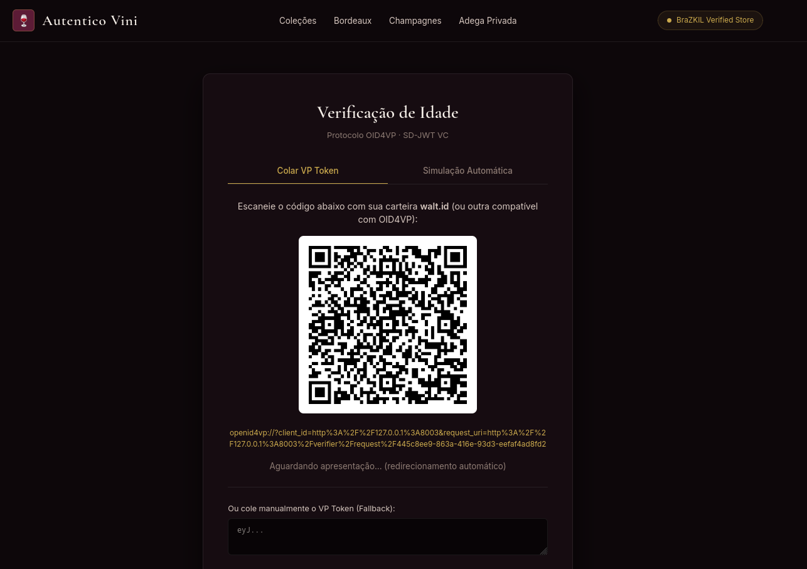

# BraZKIL: um Framework híbrido para verificação de maioridade via SSI, DID/VC e Divulgação Seletiva em conformidade com o ECA Digital

O objetivo deste artefato é demonstrar a viabilidade de implementação do BraZKIL e o funcionamento completo do fluxo proposto.

**_Resumo do artigo_**:

A entrada em vigor do ECA Digital exige mecanismos confiáveis de verificação de idade, enquanto a LGPD restringe a coleta excessiva de dados pessoais. Este trabalho propõe o BraZKIL, uma arquitetura híbrida de verificação de maioridade baseada em identidade autossoberana, identificadores descentralizados, credenciais verificáveis e divulgação seletiva. A arquitetura separa a validação inicial, apoiada em uma fonte autoritativa, das comprovações posteriores realizadas por uma credencial reutilizável sob controle do titular. Foi implementada uma prova de conceito com SD-JWT VC, serviços locais, uma carteira digital de código aberto e integração ao ambiente de demonstração do Datavalid. Os resultados indicam a viabilidade funcional do fluxo e permitem que o verificador receba apenas a afirmação de maioridade, sem acesso a CPF, biometria, data de nascimento ou aos demais dados utilizados na validação inicial.

# Estrutura do README.md

Este README está organizado nas seguintes seções:

* **Título e Resumo**: título do projeto e um resumo conciso do artigo.
* **Estrutura do Projeto**: visão geral da organização do código-fonte.
* **Funcionalidades**: principais funcionalidades e o que é possível fazer com o artefato.
* **Selos Considerados**: selos do SBSeg requeridos pelo artefato.
* **Informações Básicas**: ambiente de execução e componentes envolvidos.
* **Dependências**: requisitos de software e serviços externos.
* **Preocupações com Segurança**: cuidados necessários ao utilizar a ferramenta.
* **Instalação**: passo a passo para preparar o ambiente.
* **Uso**: como o fluxo da ferramenta é utilizado.
* **Teste Mínimo**: como executar o teste funcional completo.
* **Experimentos**: como reproduzir os experimentos apresentados no artigo.
* **Finalização dos Serviços**: como encerrar a execução.
* **Licença**: informações sobre a licença do projeto.

# Estrutura do projeto

```text
Proof-of-Concept BraZKIL/
├── issuer/                       # Middleware Emissor (OID4VCI)
│   ├── main.py                   # API FastAPI do Issuer (porta 8002)
│   ├── policy.py                 # Regras da política de aceitação
│   ├── portal.html               # UI do Portal do Titular
│   ├── schema.py                 # Schemas Pydantic do OID4VCI
│   └── sd_jwt.py                 # Gerador e validador de SD-JWT VC
│
├── shared/                       # Biblioteca compartilhada
│   └── did.py                    # Gerador e resolvedor de DIDs
│
├── validator_datavalid/          # Integrador com a API Datavalid
│   ├── client.py                 # Cliente HTTP assíncrono para a API REST Serpro
│   ├── main.py                   # API FastAPI do Validador (porta 8000)
│   ├── schema.py                 # Schemas Pydantic da consulta cadastral/biométrica
│   └── service.py                # Orquestrador da validação inicial e registro no VDR
│
├── vdr/                           # Registro de Confiança e Status (VDR)
│   ├── main.py                    # API FastAPI do VDR e DID Resolver W3C (porta 8001)
│   ├── models.py                  # Modelo SQLAlchemy do banco SQLite
│   ├── schema.py                  # Schemas Pydantic do VDR e da Status List
│   └── service.py                 # Regras de negócio e gerenciamento de DIDs/Status
├── trust_registry.db              # Banco de dados SQLite (VDR)
│
├── verifier/                      # Verificador OID4VP (Loja de Vinhos)
│   ├── main.py                    # API FastAPI do Verifier (porta 8003)
│   ├── schema.py                  # Schemas Pydantic da Presentation Definition OID4VP
│   ├── verify.py                  # Núcleo criptográfico de validação
│   └── wine_shop.html             # UI web de demonstração da Loja Autêntico Vini
│
├── wallet/                        # Módulo de carteira e integração walt.id
│   └── waltid-identity/           # Carteira open-source walt.id vendorizada (v0.22)
│
├── start_brazkil.sh               # Script único de inicialização de toda a stack
├── evaluate_brazkil.py            # Reproduz as Tabelas 2 e 3 do artigo
├── test_flow.py                   # Teste end-to-end do fluxo OID4VCI
└── requirements.txt                # Dependências Python
```

> `wallet/waltid-identity/` é código vendorizado (copiado com seu próprio histórico Git), não um submódulo — não é necessário `git submodule update`.

# Funcionalidades

A Prova de Conceito (PoC) do BraZKIL demonstra, na prática, a arquitetura híbrida de verificação de maioridade descrita no artigo. Com este artefato é possível:

* **Validação de Identidade com Fonte Autoritativa:** integrar-se ao ambiente de demonstração do Datavalid para confirmar dados cadastrais (CPF, nome e data de nascimento), simulando o primeiro passo de confiança.
* **Emissão de Credenciais Verificáveis (SD-JWT):** atuar como *Issuer*, gerando uma credencial assinada com a afirmação restrita de maioridade (`age_over_18`), sem expor CPF ou data de nascimento exata.
* **Divulgação Seletiva (Privacy by Design):** revelar apenas o predicado necessário (ser maior de idade) durante uma apresentação, via *Selective Disclosure* do SD-JWT.
* **Gerenciamento de Identidade Autossoberana (SSI):** usar uma carteira digital local (baseada no *walt.id*) para resgatar, armazenar e apresentar a credencial de forma descentralizada.
* **Verificação Confiável (OID4VP):** simular um provedor de serviços (loja de vinhos virtual) que atua como *Verifier*, checando prova de posse e assinatura para liberar ou negar acesso.
* **Registro de Confiança e Revogação (VDR):** operar um *Verifiable Data Registry* local com Documentos DID (`did:brazkil`), chaves públicas, auditoria efêmera e *Status List* para checagem de credenciais revogadas.

# Selos Considerados

* **SeloD (Artefato Disponível)**
* **SeloF (Artefato Funcional)**

# Informações básicas

## Ambiente de execução

- SO: Linux (testado em Ubuntu e Arch Linux).
- Linguagem: Python 3.12+.
- Docker Engine com o plugin Compose (`docker compose`), para a carteira `walt.id`.
- Rede habilitada para acessar a API de demonstração do Datavalid (serviço externo).

## Componentes executáveis

- Serviço de validação Datavalid (porta 8000).
- Serviço VDR / Registro de Confiança (porta 8001).
- Serviço emissor — Issuer (porta 8002).
- Serviço verificador — Verifier (porta 8003).
- Carteira local baseada em `walt.id` (Docker, porta 7101).

# Dependências

## Python

Todas fixadas em `requirements.txt` e instaladas em um único passo (veja **Instalação**):

- `fastapi==0.115.6`
- `uvicorn==0.34.0`
- `httpx==0.28.1`
- `cryptography==44.0.0`
- `python-jose[cryptography]==3.3.0`
- `sqlalchemy==2.0.36`
- `pydantic==2.10.4`
- `python-multipart==0.0.20`

## Infraestrutura

- **Docker + Docker Compose plugin**: necessários para subir a stack da carteira `walt.id`. O script `start_brazkil.sh` invoca `docker compose up -d` automaticamente — não é preciso operar o Docker manualmente no fluxo padrão.
- **`iptables`**: `start_brazkil.sh` insere uma regra liberando as portas 8000–8003 na interface bridge do Docker, para que os containers da wallet consigam chamar de volta os serviços do host. Requer permissão de superusuário (`sudo`) apenas nesse ponto do script.

## Serviços externos

- **API de demonstração do Datavalid**: `https://apicenter.estaleiro.serpro.gov.br/documentacao/datavalid/demonstracao/`. O *Bearer token* de demonstração já está configurado no código.
- **Carteira walt.id**: `https://github.com/walt-id/waltid-identity` (código já vendorizado em `wallet/waltid-identity/`).

# Preocupações com segurança

Este artefato faz chamadas reais ao ambiente de demonstração do Datavalid durante a validação. Por isso:

- utilize apenas dados sintéticos ou perfis de demonstração;
- não forneça dados pessoais reais;
- execute em ambiente isolado;
- trate chaves, credenciais e arquivos de status como sensíveis;
- a PoC não cobre segurança operacional completa, proteção de chaves em hardware nem hardening de produção.

# Instalação

Siga os passos abaixo, na ordem, a partir de um terminal.

### Passo 1 — Clonar o repositório

```bash
git clone https://github.com/otavio-alv/BraZKIL.git
cd BraZKIL
```

A partir daqui, todos os comandos assumem que você está na raiz do projeto (`BraZKIL/`), salvo indicação contrária.

### Passo 2 — Criar um ambiente virtual Python (recomendado)

```bash
python3 -m venv venv
source venv/bin/activate
```

### Passo 3 — Instalar as dependências Python

```bash
pip install --upgrade pip
pip install -r requirements.txt
```

Se preferir instalar manualmente (ou se `requirements.txt` falhar por algum motivo):

```bash
pip install fastapi uvicorn httpx cryptography python-jose[cryptography] sqlalchemy pydantic python-multipart
```

### Passo 4 — Preparar o Docker para a carteira walt.id

O Docker precisa estar instalado e o serviço em execução (`sudo systemctl status docker`). Se o seu usuário **não** pertence ao grupo `docker`, prefixe os comandos Docker abaixo com `sudo`, ou adicione-se ao grupo uma única vez e reinicie a sessão:

```bash
sudo usermod -aG docker "$USER"
# depois, faça logout/login (ou: newgrp docker)
```

O `start_brazkil.sh` já sobe a stack da wallet automaticamente (veja **Teste mínimo**), então este passo é opcional — mas baixar as imagens com antecedência evita esperar o download na primeira execução:

```bash
cd wallet/waltid-identity/docker-compose
docker compose pull
cd ../../..
```

Se preferir construir as imagens localmente a partir do código-fonte vendorizado (em vez de baixar imagens prontas):

```bash
cd wallet/waltid-identity/docker-compose
docker compose build
cd ../../..
```

### Passo 5 — Dar permissão de execução ao script principal

```bash
chmod +x start_brazkil.sh
```

Instalação concluída. Prossiga para **Teste mínimo** para subir a stack completa.

# Uso

A utilização do BraZKIL nesta Prova de Conceito demonstra o ciclo de vida completo de uma identidade descentralizada para verificação de maioridade:

1. **Ativação do ambiente:** `./start_brazkil.sh` sobe os 4 microsserviços locais e a stack Docker da carteira `walt.id` em um único comando.
2. **Emissão da credencial:** como titular, acesse o portal do *Issuer* e submeta dados de demonstração. Eles são validados contra o Datavalid, e o portal gera uma *credential offer*.
3. **Resgate na carteira:** use a interface da wallet `walt.id` para aceitar a oferta. A credencial (SD-JWT), assinada e protegida criptograficamente, é armazenada no seu dispositivo.
4. **Apresentação e verificação:** ao acessar um serviço com restrição de idade (a "Loja de Vinhos" de demonstração), a plataforma solicita prova de maioridade. Sua wallet assina a prova e compartilha *apenas* `age_over_18: true`.
5. **Auditoria e monitoramento:** consulte a API do VDR para inspecionar o registro de emissores e o status de revogação de credenciais, sem qualquer dado pessoal sensível persistido em log.

Os detalhes de execução de cada endpoint estão na seção **Experimentos**, que espelha as tabelas de avaliação do artigo.

# Teste mínimo

O teste mínimo sobe os 4 microsserviços locais e a wallet `walt.id`, e confirma que todos respondem.

```bash
./start_brazkil.sh
```

O script mata processos `uvicorn` anteriores, inicia VDR, Validator, Issuer e Verifier, sobe a stack Docker da wallet e aguarda o `/health` de cada serviço responder antes de finalizar.

### Fluxo de validação

1. Confirme no terminal que os 4 serviços reportaram `ONLINE`.
2. Abra o portal do Issuer em `http://127.0.0.1:8002/portal`, preencha o formulário e gere a `credential offer`.
3. Acesse a wallet `walt.id` em `http://localhost:7101` e resgate a credencial emitida.
4. Acesse o Verifier em `http://127.0.0.1:8003/`, apresente a credencial e confirme a aprovação.
5. Consulte os registros do VDR:
   - `http://127.0.0.1:8001/vdr/issuers`
   - `http://127.0.0.1:8001/vdr/audits`
   - `http://127.0.0.1:8001/vdr/did/{did}`
   - `http://127.0.0.1:8001/vdr/credentials/status/{credential_id}`

# Experimentos

Esta seção guia o avaliador na reprodução das **reivindicações funcionais e dos resultados tabulados na Seção 5 do artigo** (Tabela 2 — Resultados da PoC BraZKIL; Tabela 3 — Latências). Pressupõe a stack em execução (`./start_brazkil.sh`).

### Experimento 1: Validação Integrada por Fonte Autoritativa (Datavalid) e Geração de Oferta (Issuer)
* **Objetivo:** confirmar que o portal do Issuer realiza a consulta cadastral via Validador e gera uma *Credential Offer*.
* **Instruções:**
  1. Acesse `http://127.0.0.1:8002/portal`.
  2. Preencha o formulário com dados de demonstração (CPF: `25774435016`, Nome: `Manuela Elisa da Mota`, Data de Nascimento: `1975-06-04`).
  3. Clique para solicitar a credencial e aguarde a validação.
* **Verificação:** o portal retorna a *Credential Offer* na tela. Nos logs, o Validador confirma a comunicação com o Datavalid e o VDR registra a auditoria sem armazenar nome, CPF ou data de nascimento.



### Experimento 2: Resgate da Credencial na Wallet walt.id
* **Objetivo:** demonstrar o uso da carteira digital para resgatar e armazenar a credencial emitida.
* **Instruções:**
  1. Acesse `http://localhost:7101`.
  2. Use a funcionalidade de adicionar credencial ("Scan/Add Credential").
  3. Cole a *Credential Offer* obtida no Experimento 1.
  4. Aceite a oferta.
* **Verificação:** a credencial de maioridade (SD-JWT VC) aparece listada na carteira. Nos logs, o Issuer (porta 8002) registra a emissão bem-sucedida.


### Experimento 3: Emissão da Credencial Verificável SD-JWT VC (Fluxo Automatizado OID4VCI)
* **Objetivo:** validar o fluxo de emissão OID4VCI Pre-Authorized Code via script automatizado.
* **Comando:**
  ```bash
  python test_flow.py
  ```
* **Verificação:** o script executa o ciclo completo de emissão com o Issuer (porta 8002): troca do `pre_authorized_code`, emissão do `c_nonce`, assinatura da prova de posse e entrega da credencial serializada em `vc+sd-jwt`.

### Experimento 4: Preservação de Privacidade e Minimização de Dados (OID4VP)
* **Objetivo:** verificar que o Verificador recebe **estritamente** a afirmação `age_over_18`, mantendo data de nascimento e CPF ocultos.
* **Instruções:**
  1. Acesse `http://127.0.0.1:8003` no navegador.
  2. Abra as ferramentas de desenvolvedor (F12 → Network).
  3. Clique em **"Verificar Maioridade via BraZKIL"**.
  4. Inspecione o payload da rota `/verifier/present`.
* **Verificação:** em `revealed_claims`, apenas `"age_over_18": true` aparece. `birthdate` permanece protegido pela árvore de hashes do SD-JWT.



### Experimento 5: Verificação de Revogação de Credencial no VDR
* **Objetivo:** demonstrar a recusa de uma credencial revogada na Status List do VDR.
* **Comando:**
  ```bash
  # 1. Marcar a credencial como REVOKED no VDR (porta 8001)
  curl -s -X POST 'http://127.0.0.1:8001/vdr/credentials/status' \
    -H 'Content-Type: application/json' \
    -d '{"credential_id": "TEST_CREDENTIAL_01", "issuer_did": "did:brazkil:issuer", "status": "REVOKED"}' | python -m json.tool

  # 2. Consultar o status como o Verificador faria
  curl -s 'http://127.0.0.1:8001/vdr/credentials/status/TEST_CREDENTIAL_01' | python -m json.tool
  ```
* **Verificação:** o VDR retorna `"is_valid": false` e `"status": "REVOKED"`, o que interrompe a Etapa 2 de `verify_presentation` e rejeita o acesso imediatamente.

### Experimento 6: Avaliação Automatizada de Reivindicações e Latências (Tabelas 2 e 3)
* **Objetivo:** reproduzir, em um único script, todas as **reivindicações funcionais** e o **benchmark de latências** do artigo.
  - **Reivindicações funcionais (Tabela 2):** emissão do SD-JWT protegendo atributos base, apresentação via *Selective Disclosure* (só `age_over_18`), integridade OID4VP e bloqueio por revogação.
  - **Benchmark (Tabela 3):** `N=50` execuções da validação na API e `N=1000` das demais operações, com média e desvio padrão.
* **Comando:**
  ```bash
  python evaluate_brazkil.py
  ```
* **Verificação:** o console exibe `[PASS]`/`[FAIL]` para cada reivindicação e imprime a tabela consolidada de latências (média e desvio).

# Finalização dos Serviços

Para encerrar os microsserviços Python:

```bash
./start_brazkil.sh stop
```

Para também derrubar a stack Docker da wallet:

```bash
cd wallet/waltid-identity/docker-compose
docker compose down
cd ../../..
```

# LICENSE

Este projeto está licenciado sob os termos da **MIT License**. Consulte o arquivo [LICENSE](LICENSE) para mais detalhes.
